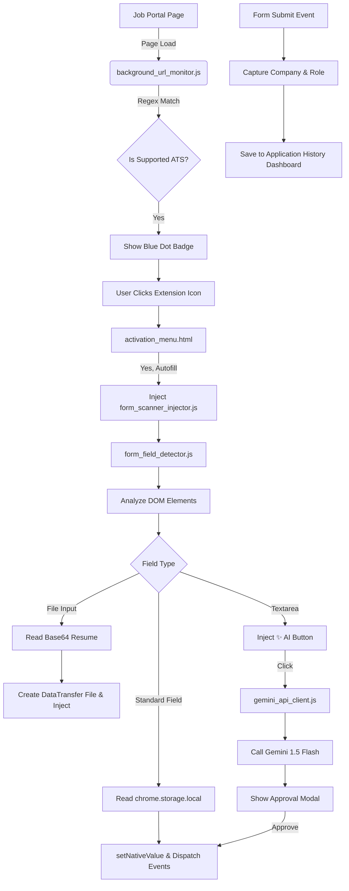

# 🚀 AutoApply: AI-Powered Job Application Assistant

AutoApply is a completely local, AI-powered Chrome Extension designed to automate the repetitive parts of job hunting. It intelligently detects job application forms, auto-fills your profile and resume, and uses Google Gemini Flash AI to contextually answer open-ended questions.

**Zero Data Collection. 100% Local Storage.**

---

## 🌟 Features

- **🧠 Smart Field Detection**: Uses heuristic regex patterns to identify name, email, experience, education, and custom fields across ATS platforms (Greenhouse, Lever, Workday, etc.).
- **📄 Base64 Resume Injection**: Upload your PDF resume once. The extension converts it to a secure Base64 string locally and rehydrates it into a `File` object to inject directly into `<input type="file">` elements.
- **✨ AI Auto-Answers**: Integrates with Google Gemini 1.5 Flash to generate custom answers for textareas based on the job context and your profile. Includes a UI to review, regenerate, or reject the AI answer.
- **📊 Application Tracker**: Passively listens to `submit` events on job boards to automatically log the Company, Role, Status, and Date in a sortable CSV-exportable dashboard.
- **🔒 100% Privacy**: All data, including your API key and resume, is stored exclusively in `chrome.storage.local`.

---

## 🏗 Architecture

---

## 🛠 Installation (Chrome Extension)

1. Download or clone this repository to your local machine.
2. Open Google Chrome and navigate to `chrome://extensions/`.
3. Turn on **Developer mode** using the toggle in the top right corner.
4. Click **Load unpacked** in the top left.
5. Select the `autoapply` folder containing the `manifest.json` file.
6. The AutoApply extension will be installed! Pin it to your toolbar for easy access.

---

## 🚀 How to Use

### 1. Setup Your Profile
Click the AutoApply extension icon and select **Setup Profile**. Fill in your personal details, experience, education, skills, and upload your PDF Resume. Add your Gemini API Key to enable AI answers.

### 2. Apply to Jobs
Navigate to any supported job board (e.g., a Greenhouse or Lever application page). The extension icon will show a small **Blue Dot**.
Click the extension icon and select **Yes, Autofill**.

### 3. Review AI Answers
For open-ended questions, click the **✨ AI Answer** button injected above the textarea. Review the generated answer in the popup modal, regenerate if needed, and click **Insert**.

### 4. Track Applications
Once you submit the form, AutoApply automatically logs it. Click **Application History** in the extension menu to view, sort, update statuses, or export your applications to CSV.

---

## 📁 File Structure

- `manifest.json`: Extension configuration and permissions.
- `background_url_monitor.js`: Service worker for passive URL tracking.
- `local_data_store.js`: Wrapper for `chrome.storage.local`.
- `profile_setup_form.html / .js`: Profile management UI.
- `activation_menu.html / .js`: Smart popup UI.
- `form_field_detector.js`: Heuristic DOM detection logic.
- `gemini_api_client.js`: AI API wrapper.
- `form_scanner_injector.js`: Content script that handles DOM injection, AI modals, and submit tracking.
- `application_history.html / .js`: Dashboard UI.
- `theme_styles.css`: Global glassmorphic design system.

---

*Built with strict adherence to local-first data privacy.*
